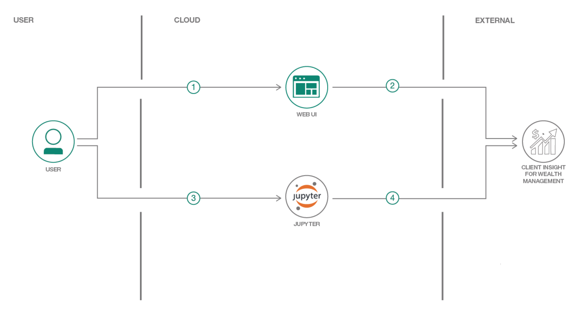
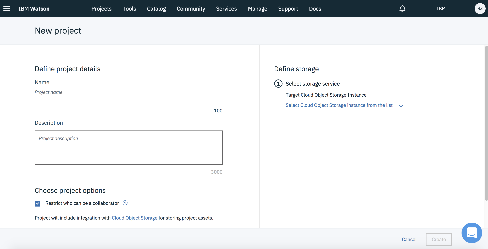
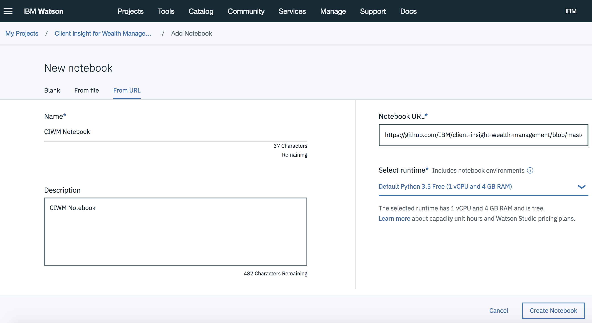
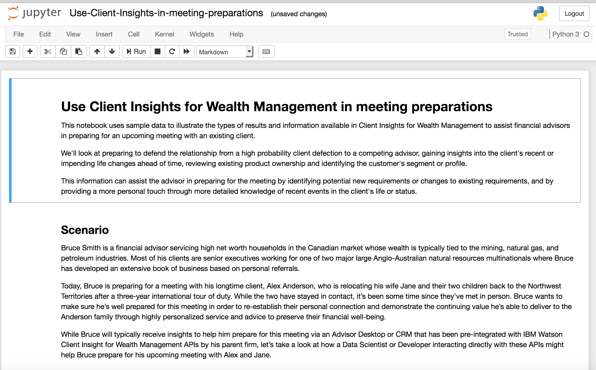
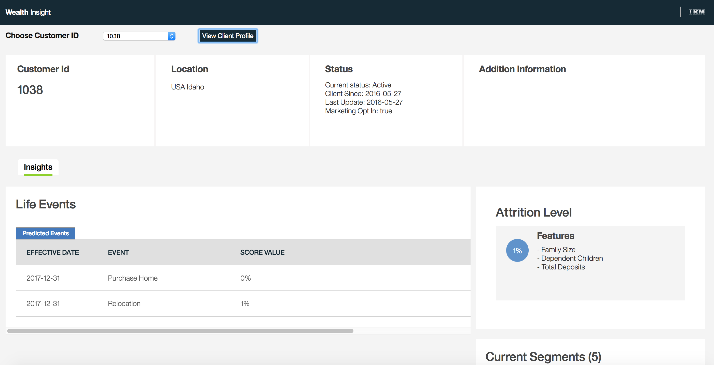

# Client Insight for Wealth Management

In this code pattern, we will explore the Client Insight for Wealth Management service. We will use the service to retrieve and display client data and analytics.  These analytics include attrition score, predicting life events and segmenting your clients based on their attributes. This can provide wealth management companies key insights to provide greater service and retaining clients.  In this code pattern, we walk through the service in a Jupyter Notebook to understand the calls and data retrieved from the service. Next, we display the retrieved data through a dashboard by creating a Python Flask web application using the service.

This code pattern is designed for developers with interest in financial services or providing enhanced customer service. When the reader has completed this code pattern, they will understand how to:

* Retrieve client insight through the Client Insight for Wealth Management (CIWM) service
* Walk through Notebook to understand use of the service
* Create a web application with a dashboard to display client insights


# Architecture Flow



1. The user accesses the application through a web interface to view client profile
2. The application will retrieve client information and analytics through the Client Insight for Wealth Management service
3. The user can walk through notebook to understand the Client Insight for Wealth Management service use case
4. The notebook will allow user to call the Client Insight for Wealth Management service and display retrieved raw data


## Included Components
* [Client Insight for Wealth Management](https://console.bluemix.net/docs/services/client_insight_wealth/index.html#getting_started_client_insight_wealth_short): Client Insight for Wealth Management service provides a set of analytical models that help you obtain client insights for use in marketing, distribution, and services provision
* [IBM Watson Studio](https://dataplatform.ibm.com): Analyze data using RStudio, Jupyter, and Python in a configured, collaborative environment that includes IBM value-adds, such as managed Spark.
* [Jupyter Notebook](http://jupyter.org/): An open source web application that allows you to create and share documents that contain live code, equations, visualizations, and explanatory text.


## Featured technologies
* [Python](https://www.python.org/downloads/) Python is a programming language that lets you work more quickly and integrate your systems more effectively.
* [JQuery](https://jquery.com): jQuery is a cross-platform JavaScript library designed to simplify the client-side
scripting of HTML.

# Steps

1. [Clone the repo](#1-clone-the-repo)
2. [Explore the Notebook](#2-explore-the-notebook)
3. [Run the Application](#3-run-the-application)


## 1. Clone the repo

Clone the Client Insight for Wealth Management code locally. In a terminal, run:

```
git clone https://github.com/IBM/client-insight-wealth-management.git
cd client-insight-wealth-management/
```

## 2. Explore the Notebook

The notebook in the repo provides a descriptive walk through of the service and how it can guide a financial advisor with key insights about the client.  It provides API calls to the service and displays the data returned from the service.  The notebook can be explored on the cloud through Watson Studio, or setup locally with Jupyter Notebook.

### Explore in Watson Studio

Watson Studio provides all the resources to run the notebook.

#### Prerequisites

- [IBM Cloud account](https://console.bluemix.net/registration/?target=%2Fdashboard%2Fapps)

#### Steps

Follow the steps below to launch Watson Studio and open the notebook from this repository.

* First using your IBM Cloud account, sign into [Watson Studio](https://dataplatform.cloud.ibm.com/).  Here you can create a new project by choosing the `New Project` link on the right.


* You can give your project a name and provide a description. Ensure you have a `Cloud Object Storage` which can be linked to the project for storing project assets.



* Once you have your project opened, you can use the `Add to Project` link to add a `Notebook` to the project.  Here we will choose the `From URL` tab to add notebook from this repository.  Provide a name and description for the notebook, and in the `Notebook URL` field provide the following url:

```
https://github.com/IBM/client-insight-wealth-management/blob/master/notebook/Leverage-Client-Insights.ipynb
```

Click `Create Notebook` to open the notebook.



* Once you have the notebook opened in Watson Studio, you can walk through each cell by clicking the `Run` button in the menu.


### Locally with Jupyter notebook

The notebook can be opened locally using Jupyter Notebook.  This will open the notebook in a web browser with the Python kernal to run the notebook.

#### Prerequisites

- [Jupyter Notebook](http://jupyter.org/install)
- [Python](https://www.python.org/downloads/)

#### Steps

* First install the notebook's dependencies
```
pip install -r requirements.txt
```

* Next open a terminal and go to the `notebook` folder. Use the following command to open the notebook in a web browser.

```
cd notebook/
jupyter notebook
```

This will open the notebook in a browser. Here, walk through the notebook running each cell to gain understanding for the Client Insight for Wealth Management service.




## 3. Run the Application

To run the application, go to the root folder and:

+ Install dependencies `pip install -r requirements.txt`
+ Run `python run.py`
+ Access the running app in a browser at <http://0.0.0.0:8080/>



## Deploy Application to IBM Cloud

You can deploy the application to IBM Cloud using the ``Deploy to IBM Cloud`` button or deploy using the IBM Cloud CLI.   

#### Deploy to IBM Cloud button

* Deploy the application directly on IBM Cloud using the ``Deploy to IBM Cloud`` button

[](https://bluemix.net/deploy?repository=https://github.com/IBM/client-insight-wealth-management)

#### Use IBM Cloud CLI

* This will use the specifications provided in the ``manifest.yml`` file.  You can update the manifest.yml file to provide certain attribute including the url name.
```
applications:
- path: .
  name: client-insight
  memory: 128M
  random-route: true
  instances: 1
  buildpack: python_buildpack

```

* Use the IBM Cloud CLI to push the app to IBM Cloud.  Login and then inside folder run:

```
bx push
```


## <h2>Learn more</h2>
<ul>
<li><strong>Finance Code Patterns</strong>: Enjoyed this Code Pattern? Check out our other <a href="https://developer.ibm.com/code/industries/finance/" rel="nofollow">Finance Code Patterns</a>.</li>
<li><strong>Data Analytics Code Patterns</strong>: Enjoyed this Code Pattern? Check out our other <a href="https://developer.ibm.com/code/technologies/data-science/" rel="nofollow">Data Analytics Code Patterns</a></li>
<li><strong>Watson Studios</strong>: Master the art of data science with IBM's <a href="https://datascience.ibm.com/" rel="nofollow">Watson Studios</a></li>
</ul>


# License

This code pattern is licensed under the Apache Software License, Version 2.  Separate third party code objects invoked within this code pattern are licensed by their respective providers pursuant to their own separate licenses. Contributions are subject to the [Developer Certificate of Origin, Version 1.1 (DCO)](https://developercertificate.org/) and the [Apache Software License, Version 2](http://www.apache.org/licenses/LICENSE-2.0.txt).

[Apache Software License (ASL) FAQ](http://www.apache.org/foundation/license-faq.html#WhatDoesItMEAN)
